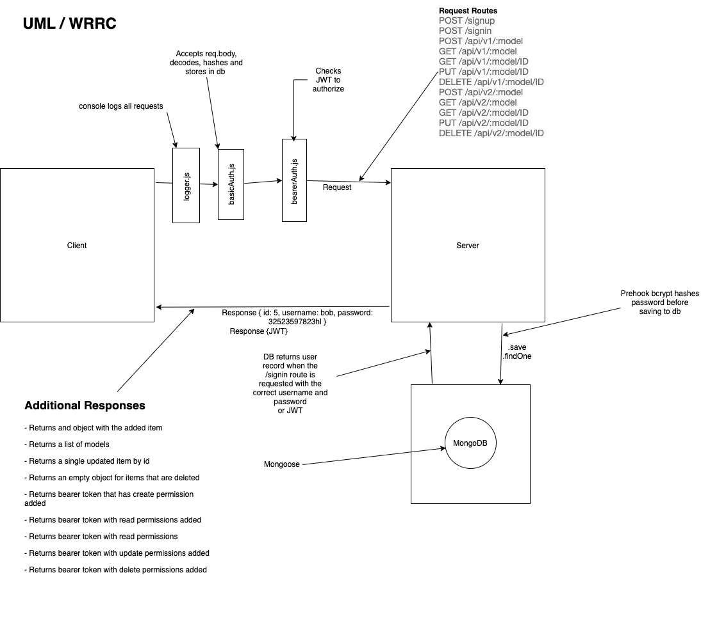

# LAB - 08

## Project: Auth-API

### Author: Simon Panek

#### Contributors and Collaborators: Mariko, Ricardo, Nathan, Stacy, Matt

### Links and Resources

- [GitHub Actions](https://github.com/simon-panek/auth-api/actions)
- [Heroku Deployment](https://simonpanek-auth-api.herokuapp.com/)

### Setup

#### `.env` requirements (where applicable)

- `PORT` - 3000
- `MONGOOSE_URI` - mongodb://localhost:27017/auth3
- `SECRET` - goldfish

#### How to initialize/run your application (where applicable)

- `npm start`
- `npm test`
- Endpoints:
  - AUTH Routes
    - POST /signup creates a new user and sends an object with the user and the token to the client
    - POST /signin with basic authentication headers logs in a user and sends an object with the user and the token to the client
  - V1 (Unauthenticated API) routes
    - POST /api/v1/:model adds an item to the DB and returns an object with the added item
    - GET /api/v1/:model returns a list of :model items
    - GET /api/v1/:model/ID returns a single item by ID
    - PUT /api/v1/:model/ID returns a single, updated item by ID
    - DELETE /api/v1/:model/ID returns an empty object. Subsequent GET for the same ID should result in nothing found
  - V2 (Authenticated API Routes)
    - POST /api/v2/:model with a bearer token that has create permissions adds an item to the DB and returns an object with the added item
    - GET /api/v2/:model with a bearer token that has read permissions returns a list of :model items
    - GET /api/v2/:model/ID with a bearer token that has read permissions returns a single item by ID
    - PUT /api/v2/:model/ID with a bearer token that has update permissions returns a single, updated item by ID
    - DELETE /api/v2/:model/ID with a bearer token that has delete permissions returns an empty object. Subsequent GET for the same ID should result in nothing found

#### Security

- This app uses JWT to authorize access to the authenticated routes

#### Tests

- Tests run on the basic-auth-middleware, bearer-auth-middleware, and router.

#### UML

